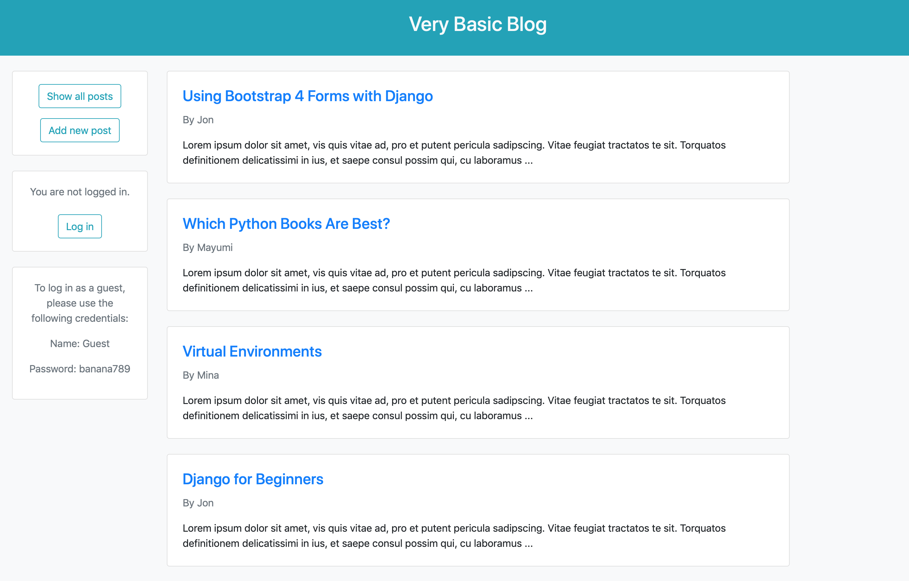

# blog_project

### Overview

A basic blog application provided with CRUD functionality. 

Built following chapters 5-7 of [Django for Beginners](https://djangoforbeginners.com). 

[Live demo](https://jjl-blog.herokuapp.com) (deployed on Heroku).

### Features

Uses a basic Post model including title, body, and author fields. The author field is linked to Django's User model through use of a foreign key, providing a one-to-many relationship between authors and posts. 

Utilises Django's built-in class-based views, specifically ListView and DetailView for displaying blog posts, CreateView and UpdateView for form-handling when creating and updating blog entries, and DeleteView for deleting individual posts. 

Also Uses Django's auth app for user authentication as well as the form class UserCreationForm for user sign up. 

Doesn't include user authentication permissions as this was addressed in later chapters in the textbook.

### Built using:

* Python 3.7
* Django 3.0.8
* django-crispy-forms 1.9.2
* Gunicorn 20.0.4
* Bootstrap 4
* Visual Studio Code 1.47.3
* macOS 10.14.6
* Heroku

### Screenshot:

